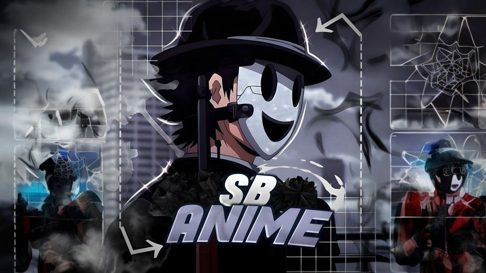

<p align="center">
  
</p>

<h1 align="center">⚡ Suhani FileStore v1.0</h1>

<p align="center">
  <b>Premium Multi-User Telegram FileStore Bot Platform</b><br>
  <i>Create, manage, and scale your own FileStore bots from a single controller.</i>
</p>

<p align="center">
  <a href="https://t.me/suhanibots"></a>
  
  
  
</p>

---

## ✨ Features

| Feature | Description |
|---------|-------------|
| 🤖 **Multi-User Bot Creation** | Users create their own FileStore bots via inline buttons |
| 📂 **File Storage & Sharing** | Store files in channels and share via deep-link URLs |
| 🔗 **Force Subscribe** | Join & Request modes with multiple channels per bot |
| 💰 **URL Shortener** | Compatible link monetization per bot |
| 👥 **Admin Management** | Add/remove admins per bot |
| ⏱ **Auto-Delete Timer** | Files auto-delete after a configurable time |
| 📩 **Custom Start Message & Photo** | Bot owners personalize their bot's welcome screen |
| 📝 **Custom Captions** | Set formatted custom captions and placeholders per bot |
| 📢 **Broadcast System** | Main bot and worker bots can broadcast messages to users |
| 🛡️ **Content Protection** | Toggle anti-forwarding to protect your shared files |
| 🚫 **Ban / Unban Users** | `/ban` and `/unban` commands for both main & worker bots |
| 🔗 **Formatted Link Generator** | `/flink` command for batch link formatting |
| 📦 **Data Transfer** | Transfer users, admins & settings from a deleted bot to a new one |
| 💤 **Auto-Hibernation** | Bots idle for 48+ hours are automatically stopped to save RAM |
| 🔐 **Owner Panel** | Secret `/check` command to inspect all bots, tokens & owners |

---

## 🏗 Architecture

```
┌──────────────────────────────────────┐
│          Main Controller Bot         │
│  /start • Create Bot • My Bots      │
│  Force-Sub Gate (@suhanibots)    │
└──────────────┬───────────────────────┘
               │ manages
    ┌──────────┼──────────┐
    ▼          ▼          ▼
┌────────┐ ┌────────┐ ┌────────┐
│Worker 1│ │Worker 2│ │Worker N│  ← Pyrogram Clients
│ @bot_a │ │ @bot_b │ │ @bot_n │
└───┬────┘ └───┬────┘ └───┬────┘
    │          │          │
    └──────────┼──────────┘
               ▼
         ┌──────────┐
         │ MongoDB  │  ← Namespaced collections per bot
         └──────────┘
```

---

## 📁 Project Structure

```
├── config.py              # Environment vars, UI texts, logging
├── run.py                 # Entry point (starts everything)
├── requirements.txt       # Dependencies
│
├── main_bot/
│   └── plugins/
│       ├── start.py       # /start, menu, help, about, fsub gate
│       ├── create_bot.py  # Bot creation flow
│       ├── my_bots.py     # Bot list, dashboard, transfer data
│       ├── bot_settings.py# Force-sub, shortener, admins, stats
│       └── bans.py        # /ban, /unban for main bot
│
├── worker_bot/
│   ├── engine.py          # Dynamic multi-client manager
│   └── flink_logic.py     # Formatted link generator
│
├── database/
│   ├── mongo.py           # Motor client singleton
│   ├── main_db.py         # Bot registry, user management
│   └── worker_db.py       # Per-bot collections (isolated)
│
└── utils/
    ├── helpers.py          # Encode/decode, validation, message utils
    ├── security.py         # Token masking utilities
    └── shortener.py        # URL shortener API client
```

---

## ⚡ Quick Start

### 1. Clone the repo

```bash
git clone https://github.com/abhinai2244/Muti-FileStoreBot.git
cd Muti-FileStoreBot
```

### 2. Install dependencies

```bash
pip install -r requirements.txt
```

### 3. Configure environment variables

Set the following in your environment or edit `config.py`:

| Variable | Required | Description |
|----------|----------|-------------|
| `API_ID` | ✅ | Telegram API ID from [my.telegram.org](https://my.telegram.org) |
| `API_HASH` | ✅ | Telegram API Hash |
| `BOT_TOKEN` | ✅ | Main controller bot token from @BotFather |
| `OWNER_ID` | ✅ | Your Telegram numeric user ID |
| `MONGO_URI` | ✅ | MongoDB connection string |
| `MAIN_LOG_CHANNEL` | ✅ | Channel ID for system logs |
| `FSUB_CHANNEL` | ❌ | Force-sub channel username (default: `suhanibots`) |
| `MAX_BOTS_PER_USER` | ❌ | Bot limit per user (default: `1`) |

### 4. Run

```bash
python run.py
```

---

## 🚀 Deploy on Heroku

1. Add a `Procfile` to your repo:
   ```
   worker: python run.py
   ```

2. Set all environment variables in Heroku Settings → Config Vars.

3. Deploy as a **Worker** dyno (not Web).

> **RAM Note:** A Heroku Basic dyno (512MB) can handle ~15-20 active bots simultaneously. The auto-hibernation system will sleep idle bots to free RAM automatically.

---

## ☁️ Deploy Backend API (Cloudflare Workers)

The backend provides the API for the permanent link feature. It is built to be deployed on **Cloudflare Workers**.

1. Navigate to the backend directory:
   ```bash
   cd backend
   ```

2. Install dependencies:
   ```bash
   npm install
   ```

3. Update `wrangler.toml` with your MongoDB credentials:
   - `MONGODB_APP_ID`: Your MongoDB App ID.
   - `MONGODB_DATABASE`: Your MongoDB database name.
   - `MONGODB_API_KEY`: Your MongoDB Data API Key.
   - `BACKEND_API_SECRET`: A secure secret key (make sure it matches `BACKEND_API_SECRET` in your bot's `config.py`).

4. Deploy to Cloudflare Workers:
   ```bash
   npx wrangler deploy
   ```

5. Once deployed, copy your Cloudflare Worker URL and set it as `BACKEND_API_URL` in your bot's `config.py`.

---

## 📦 Data Transfer System

When a bot is deleted, its data (users, admins, channels, banned list) is **preserved** in MongoDB.

To transfer data to a new bot:
1. Delete the old bot from the dashboard
2. Create a new bot
3. Go to the new bot's **Dashboard** → tap **📦 Transfer**
4. Select the old bot → data is copied instantly
5. Old bot data is permanently cleaned up after transfer

> **Tip:** Use the **same log channel** on the new bot to keep old generated links working.

---

## 🔐 Owner Commands

| Command | Description |
|---------|-------------|
| `/check` | View all registered bots with owner info, tokens & status |
| `/broadcast` | Broadcast a message to all users of the platform |
| `/ban <user_id>` | Ban a user from the main controller bot |
| `/unban <user_id>` | Unban a user |

---

## 🛡 Worker Bot Commands (for bot admins)

| Command | Description |
|---------|-------------|
| `/start` | Welcome message / file retrieval via deep links |
| `/genlink` | Generate a shareable link for a single post |
| `/batch` | Generate a link for multiple consecutive posts |
| `/custom_batch` | Generate links for non-consecutive posts |
| `/flink` | Formatted batch link generator |
| `/broadcast` | Broadcast a message to the bot's users |
| `/ban <user_id>` | Ban a user from the worker bot |
| `/unban <user_id>` | Unban a user |

---

## 📄 License

This project is open source. Feel free to fork, modify, and deploy.

---

<p align="center">
  <b>Developed by <a href="https://t.me/suhanibots">@suhanibots</a></b>
</p>